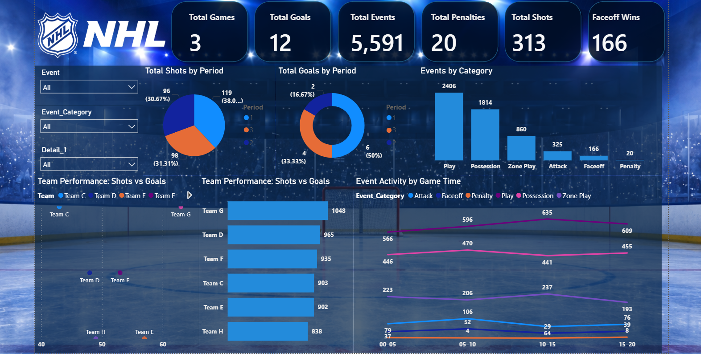

# 🏒 Ice Hockey Analytics Dashboard

An interactive **Power BI sports analytics dashboard** built to analyze ice hockey game events, scoring patterns, shot volume, team activity, and game-period performance.

## 📌 Project Overview

This project transforms event-level ice hockey data into an interactive analytical dashboard designed to answer practical sports-analytics questions such as:

- How does scoring vary by period?
- How is shot volume distributed across periods?
- Which event categories contribute most to overall game activity?
- How do teams compare in shot volume and goal production?
- Which teams generate the highest overall event activity?
- How does event activity change throughout game time?

The focus is on turning raw event records into **clear, decision-oriented visual insights** rather than simply presenting charts.

## 📊 Key Metrics

| Metric | Value |
|---|---:|
| Games Analyzed | 3 |
| Goals | 12 |
| Game Events | 5,591 |
| Shots | 313 |
| Faceoff Wins | 166 |
| Penalties | 20 |

> **Note:** The analysis covers three games, so the results should be interpreted as a game-level sample rather than league-wide performance benchmarks.

## 📈 Dashboard Features

### Executive KPIs
- Total Games
- Total Goals
- Total Events
- Total Shots
- Faceoff Wins
- Total Penalties

### Game & Scoring Analysis
- Goals by Period
- Shots by Period
- Event Activity by Game Time

### Team Analysis
- Team Performance: Shots vs Goals
- Total Events by Team

### Event Analysis
- Events by Category
- Breakdown of game activity across event categories such as Play, Possession, Zone Play, Attack, Faceoff, and Penalty

## 🛠️ Tools & Technologies

- **Power BI** — Dashboard development and interactive visualization
- **DAX** — KPI measures and analytical calculations
- **Power Query** — Data transformation and preparation
- **Data Modeling** — Structuring event-level data for analysis
- **Data Visualization** — Sports-focused analytical storytelling

## 🧹 Data Preparation

The event data was prepared before visualization through steps including:

1. Combining multiple game-event CSV files into a master event table.
2. Cleaning and converting date, time, and numeric fields.
3. Preserving valid event-level records and handling expected missing detail fields.
4. Creating event categories for higher-level analysis.
5. Creating game-time buckets for analyzing event activity during the game.
6. Building DAX measures for reliable game-level KPI calculations.
7. Designing the dashboard around team, period, event, and scoring analysis.

## 🗂️ Repository Contents

| File | Description |
|---|---|
| `icehockey.pbit` | Power BI template containing the dashboard and report structure |
| `Dashboard.png` | Dashboard preview image |
| `README.md` | Project documentation |

## 📚 Dataset

The project uses event-level ice hockey data from **Big Data Cup 2025**, featuring Stathletes-tracked hockey event data. The competition dataset includes recorded actions such as shots, goals, plays, takeaways, puck recoveries, dump-ins/outs, zone entries, faceoffs, and penalties.

The games in this project are based on **AHL game data** and should not be interpreted as NHL data.

**Source:** Big Data Cup 2025 / Stathletes

## 🔍 Analytical Approach

The dashboard combines descriptive and comparative analysis:

- **Descriptive analysis:** overall game, scoring, shooting, penalty, and event-volume KPIs.
- **Temporal analysis:** scoring, shooting, and event activity by period/game time.
- **Team comparison:** shot volume versus goal production and total event activity.
- **Event composition:** understanding how different types of hockey actions contribute to overall game activity.

## 🚀 Future Enhancements

Potential next iterations of the project could include:

- Shot-location heatmaps using X/Y coordinates
- Player-level performance analysis
- Expected Goals (xG) modeling
- Zone-entry and zone-exit success rates
- Shift and player-ice-time analysis
- Advanced possession metrics
- Interactive player/team drill-through pages
- Additional games for a larger analytical sample

## ⚠️ Limitations

- The current dashboard analyzes only three games.
- Event-level data captures recorded actions but does not by itself provide every contextual factor involved in hockey performance.
- Findings should therefore be treated as exploratory insights from the selected sample.

## 👤 Author

**Keshav Sharma**

Data Analyst | Power BI | SQL | Python | Data Visualization

---

⭐ If you find this project useful, feel free to explore the dashboard and provide feedback or suggestions for additional hockey analytics.
